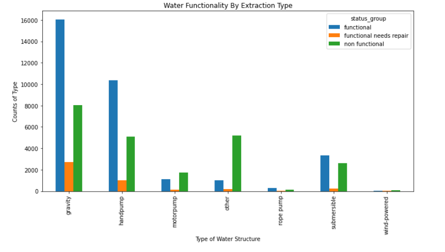
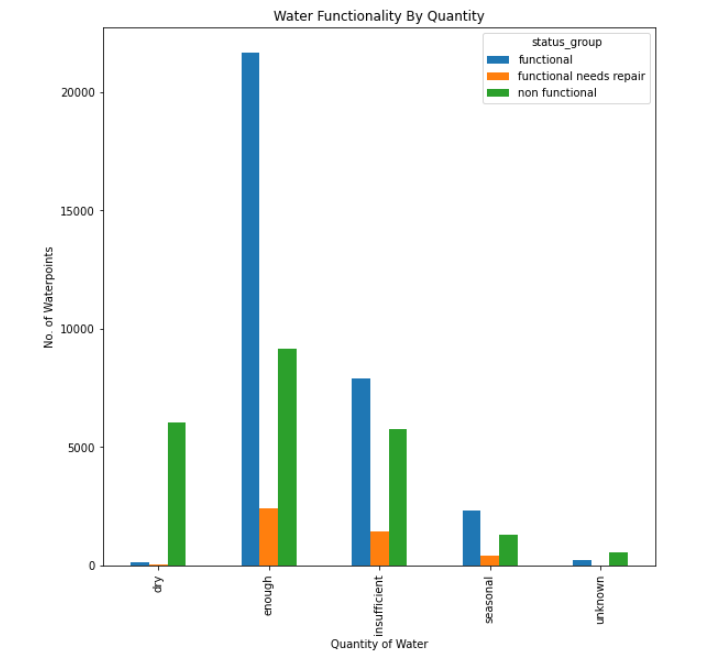
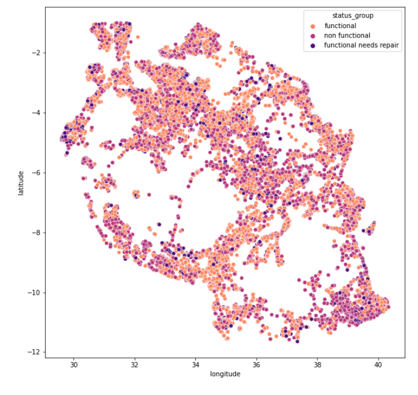
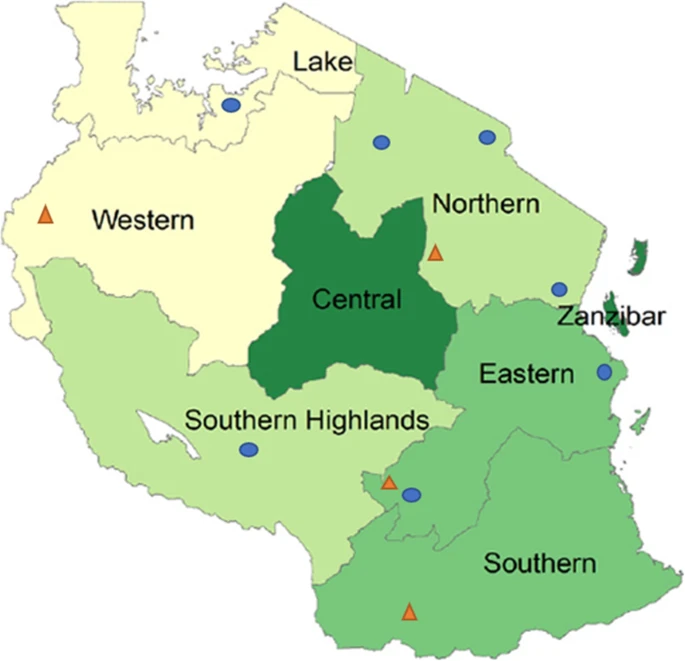
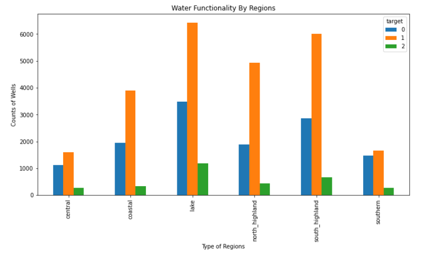

# Tanzania Water Points Project

## Project Goal

**My mission aims to predict the functionality of different water points spread throughout Tanzania. By predicting the functionality of water points, the Tanzanian Ministry of Water could better prepare maintenance for water points that needs repair. This could potentially save them time, money, and resources which can be used elsewhere.**

## Findings
**My current model is able to explain about 79% of the variance in the functionality of each water point. It was able to accurately predict 71% of non-functional waterpoints, 91% functional water-points, and only 24% of functional water points that needed to be repaired.**

## Data Source and Exploration
This data comes from a Kaggle competition which provides details about water points in Tanzania in East Africa. 

I used 40 columns for my analysis, which included variables about:
* Descriptive like quantity and quality of water
* The location, districts, population of area, etc
* Clerical details including price, management, funder of the water points, etc.

Looking at the target variables, I can see that there’s some imbalance in the classes. This can cause the models to less accurately predict the class that has the fewest points. One common way to deal with this is by combining two of the classes. In this case I would combine “functional needs repair” and “non-functional” for the simple fact that they both need attention. For the sake of time and later comparability, I decide to keep the three classes separately

## Data Preparation 
Since this is a classification problem, I had to deal with categorical data. I performed one hot-encoding on the majority of the categorical columns such as regions, extraction type, source type, etc. However to help with the amount of columns some of the columns were converted into binary variables such as the permit column having “1” for yes permit and “0” for no permit.

## Observations

### Which structure has the most water points?



I wanted to see which type of structure is more popular and most reliable. Looking at the graph:
* Gravity well are the most popular.
* motor pump water points is the only structure that has more non functional water points then functional.
* Gravity pumps are the way to go, seeing that only about 13% are non functional and 5% needs repair.

### Does the quantity affect the status?


* We see that enough water is a great predictor for functional wells. 
* Makes sense that dry well have more non functional wells because of the lack of water. 
* Insufficient has an almost balance between functional and non functional. It might suggest that the wells with a little bit left are still functional whereas the ones that doesn't have any aren't functional anymore.

* So our best bet to finding functional wells would be quantity enough and dry for finding non functional wells.

### Does location play a role?

I wanted to see if different areas affected the status of wells.






So majority of the wells are located in Lake and South highland zones. These zones can possibly be located near bodies of water such as lakes, which can provide a good source of water. Zones like central are a little ways away from large water sources, therefore not many wells are installed there. However it's hard to make certain assumptions because other factors like population can play an important role. 


## Recommendations:

According to my model and the graphs above some of the best predictors for pointing out the status of the wells are:
1. The status of the quantity. How much a well has can help predict if it's functional. Dry wells tend to have more non functional wells, whereas enough has the most functional well of the bunch.

2. Location: The zones that are near a body of water seems to have the most functional wells, along with the most wells installed. 

## Next Steps 
In the future I would like to find a way to balance the classes or combine two of them for better results. We can also look into the type of extraction of each water point. Some models might last longer depending on the water type and quality of the water in the area. We should also look into the population of each area. It’s safe to say a more populated area uses the water point often and could cause wear and tear from use.

```python

```
